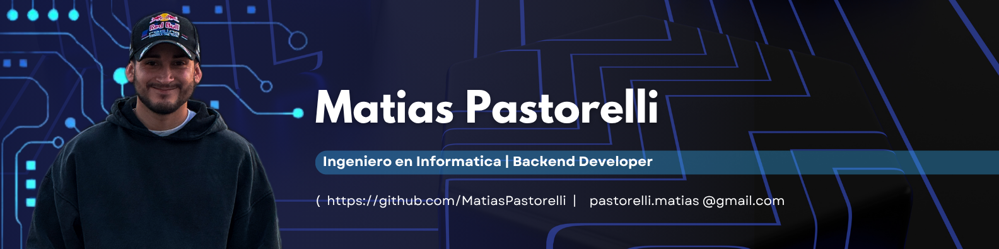

## 👋 Hola, soy Matías Ignacio Pastorelli

## 👨‍💻 Sobre mí

👨‍🔧 Desarrollador con +4 años creando APIs y microservicios que funcionan bien, escalan y se mantienen en producción. Trabajo con Node.js (Express, NestJS) y Laravel, usando Docker, Kubernetes/ECS y pipelines de CI/CD (Jenkins, GitLab CI, GitHub Actions).

🧠 Manejo JavaScript/TypeScript, PHP 8, PostgreSQL, MongoDB, Redis, y algo de DynamoDB. He integrado Kafka y RabbitMQ, participando en arquitecturas event-driven.

🧪 Aplico buenas prácticas como TDD/BDD (Jest), con foco en la calidad del código (+85 % cobertura, análisis en SonarQube, escaneos OWASP).

☁️ En la nube (AWS) he optimizado recursos con Lambda, API Gateway, RDS, S3, logrando mejoras en costos y disponibilidad.

🔄 Participé en la migración de un monolito a microservicios, bajando los despliegues de 40 min a 7 min. También he mentoreado a devs junior, haciendo code reviews y pair programming.

🤝 Me destaco por la comunicación clara, pensamiento crítico y muchas ganas de seguir aprendiendo. Busco equipos con una cultura técnica sólida, donde pueda crecer en serverless, seguridad y observabilidad.

---

## 🧰 Stack Tecnológico

<!-- Fila 1 -->

 

<!-- Fila 2 -->

 

<!-- Fila 3 -->

## 💼 Experiencia

Un resumen de mi trayectoria profesional. Para ver el detalle completo, haz clic en el botón:

---

## 🚀 Proyectos Destacados

### [system-auth](https://github.com/MatiasPastorelli/system-auth) &nbsp; 

Sistema centralizado de autenticación para microservicios, construido con NestJS y principios SOLID.
Incluye autenticación JWT, integración OAuth2, middleware reutilizable y arquitectura extensible para nuevos proveedores.
Actualmente en desarrollo activo.

> **Stack:** NestJS, TypeScript, PostgreSQL, Redis, Docker, OAuth2, JWT

[Ver repositorio](https://github.com/MatiasPastorelli/system-auth)

---

## 📫 Contacto

✨ ¡Estoy abierto a nuevas oportunidades y colaboraciones! 🚀

