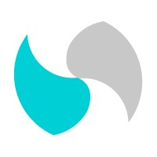

## 👋 Hola, soy Matías Ignacio Pastorelli

## 👨‍💻 Sobre mí

👨‍🔧 Desarrollador Backend con +4 años creando APIs y microservicios que funcionan bien, escalan y se mantienen en producción. Trabajo con Node.js (Express, NestJS) y Laravel, usando Docker, Kubernetes/ECS y pipelines de CI/CD (Jenkins, GitLab CI, GitHub Actions).

🧠 Manejo JavaScript/TypeScript, PHP 8, PostgreSQL, MongoDB, Redis, y algo de DynamoDB. He integrado Kafka y RabbitMQ, participando en arquitecturas event-driven.

🧪 Aplico buenas prácticas como TDD/BDD (Jest), con foco en la calidad del código (+85 % cobertura, análisis en SonarQube, escaneos OWASP).

☁️ En la nube (AWS) he optimizado recursos con Lambda, API Gateway, RDS, S3, logrando mejoras en costos y disponibilidad.

🔄 Participé en la migración de un monolito a microservicios, bajando los despliegues de 40 min a 7 min. También he mentoreado a devs junior, haciendo code reviews y pair programming.

🤝 Me destaco por la comunicación clara, pensamiento crítico y muchas ganas de seguir aprendiendo. Busco equipos con una cultura técnica sólida, donde pueda crecer en serverless, seguridad y observabilidad.

---

## 🧰 Stack Tecnológico

<!-- Fila 1 -->

 

<!-- Fila 2 -->

 

<!-- Fila 3 -->

 

<!-- Fila 4 -->

 

<!-- Fila 5 -->

 

<!-- Fila 6 -->

## 💼 Experiencia Laboral

<table border="0"><tr><td></td><td><strong>Koywe</strong> <strong>Fullstack Developer</strong> 🖥️ | <em>Enero 2025 - Mayo 2025 (5 meses)</em></td></tr></table>

**Tecnologías:** 

- 🏦 Diseñé e implementé un servicio de onboarding KYC de alto rendimiento, integrando APIs de backend para el registro seguro de datos y cumplimiento de regulaciones internacionales.
- 🪪 Desarrollé un iframe versátil para la verificación de documentos de identidad de múltiples países, optimizando la experiencia de usuario.
- 💸 Lideré la creación de un servicio de wallets con funcionalidades CRUD, conectado a proveedores de blockchain para la gestión en tiempo real de transacciones.
- 🔗 Colaboré en la integración de APIs de terceros, mejorando la eficiencia operativa en entornos blockchain.

---

<table border="0"><tr><td></td><td><strong>Itaú Chile</strong> <strong>Backend Developer</strong> 🛠️ | <em>Mayo 2023 - Noviembre 2024 (1 año 7 meses)</em></td></tr></table>

**Tecnologías:** 

- 📈 Analicé historias de usuario para diseñar soluciones técnicas eficientes y alineadas con los objetivos de negocio para la nueva aplicación ITU.
- 🔌 Desarrollé APIs, BFFs y BCLs bajo una arquitectura de microservicios, optimizando la funcionalidad y escalabilidad de la plataforma.
- 💳 Implementé módulos clave para la gestión de tarjetas (bloqueo y reemisión) con NestJS, integrando múltiples proveedores externos.
- ☁️ Diseñé y desplegué funciones Lambda en AWS para la gestión y envío automatizado de documentos por correo.
- 📊 Monitoreé y optimicé servicios con CloudWatch y Kubernetes, asegurando alta disponibilidad y rendimiento.
- 🚀 Lideré despliegues a producción y elaboré documentación técnica con pruebas unitarias (Jest) para garantizar calidad del código.

---

<table border="0"><tr><td></td><td><strong>Symbiose SpA</strong> <strong>Desarrollador</strong> 💻 | <em>Mayo 2021 - Mayo 2023 (2 años 1 mes)</em></td></tr></table>

**Tecnologías:** 

**Liberty Seguros:**
- ☁️ Diseñé y desplegué funciones Lambda en AWS utilizando Jenkins, habilitando la extracción eficiente de datos desde bases de datos.
- ⚡ Optimicé el código de aplicaciones backend, mejorando el rendimiento y la escalabilidad de los servicios.

**TOC Biometrics:**
- 🎥 Desarrollé nuevas funcionalidades para un gestor de videollamadas, mejorando la experiencia del usuario.
- 🔄 Realicé mantenimiento y actualizaciones de la plataforma, integrando nuevas tecnologías para cumplir con los requisitos de clientes externos.

---

<table border="0"><tr><td></td><td><strong>ISBAST</strong> <strong>Software Engineer</strong> 🧑‍💻 | <em>Marzo 2021 - Abril 2021 (2 meses)</em></td></tr></table>

**Tecnologías:** 

- 🤝 Colaboré en un equipo ágil para desarrollar un nuevo portal inmobiliario, diseñando soluciones backend escalables y eficientes.
- 🗃️ Modelé y optimicé una base de datos relacional en MySQL para gestionar datos inmobiliarios.
- 🔗 Diseñé y desarrollé APIs RESTful para el portal, habilitando una integración fluida con el frontend.

---

<table border="0"><tr><td></td><td><strong>Pharmatender</strong> <strong>Analista Programador Jr</strong> 👨‍💻 | <em>Diciembre 2019 - Febrero 2021 (1 año 3 meses)</em></td></tr></table>

**Tecnologías:** 

- 📊 Procesé y analicé datos de Mercado Público para generar soluciones personalizadas según las necesidades de los clientes.
- 🗄️ Diseñé y modelé bases de datos relacionales en MySQL para almacenar y gestionar eficientemente información de mercado.
- 📈 Desarrollé software para transformar datos complejos en reportes Excel, optimizando la entrega de información a los clientes.
- 🖥️ Implementé módulos con arquitectura MVC para la página principal, mejorando la funcionalidad y experiencia del usuario.

---

<!--
## 🚀 Proyectos Destacados

Aquí puedes agregar una lista de tus proyectos más relevantes. Por ejemplo:

- **Nombre del Proyecto 1**  
  _Breve descripción del proyecto, tecnologías usadas, logros o impacto._
  [Repositorio](enlace-al-repo) | [Demo](enlace-a-demo)

- **Nombre del Proyecto 2**  
  _Breve descripción del proyecto, tecnologías usadas, logros o impacto._
  [Repositorio](enlace-al-repo) | [Demo](enlace-a-demo)

---
-->

## 📫 Contacto

✨ ¡Estoy abierto a nuevas oportunidades y colaboraciones! 🚀

